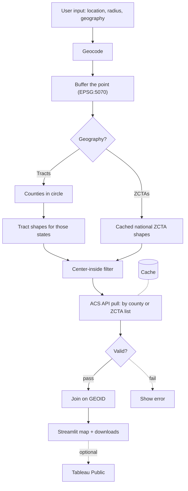

# Census Radius Explorer

Enter a US city or address and a radius in miles to get American Community Survey (ACS) demographics for every census tract or ZIP Code Tabulation Area (ZCTA) within that distance, shown on an interactive map.

> **Status: in development.** This README describes the planned design. Features are marked done in the [Roadmap](#roadmap) as they're built.

## What it will do

1. You enter a location (a city or street address), a radius in miles, and a geography level: **census tracts** or **ZCTAs**.
2. The app geocodes the location and draws a circle of that radius around it.
3. It selects every area whose interior point falls inside the circle.
4. It pulls ACS 5-year estimates for only those areas, validates them, and joins them to their boundary shapes.
5. It shows a choropleth map with the circle overlaid, a summary table, and GeoJSON/CSV downloads.

## Architecture



## Design decisions

- **Center-inside filtering.** An area counts as inside the radius when its interior point (`representative_point()`) falls within the circle. This is simple and predictable, but it undercounts at the edges. Totals are therefore labeled "areas whose center is within X miles," not as exact counts within X miles.
- **Two geography levels, two ingestion paths.**
  - *Tracts:* nested in counties, so the app finds the counties the circle touches and pulls tract data county by county.
  - *ZCTAs:* cross county and state lines, so the app selects them from a cached national shape file and requests data for that list of codes.
- **pandas for joins.** Each request involves at most a few thousand rows keyed on one GEOID, so tables are combined with pandas `merge(..., validate="one_to_one")`, and geopandas handles all spatial work. No SQL engine is needed at this scale.
- **Cache everything.** ACS estimates are fixed once a year is released, so every API response and shape download is cached by year and geography. A repeat query never calls the API again.
- **Validation before display.** Checks on GEOID format, coverage, data types, sentinel values, and geometry run before anything is mapped. If a check fails, the app shows an error instead of a misleading map. The full list is in [docs/validation.md](docs/validation.md).

## Data sources

- [Census Data API](https://www.census.gov/data/developers.html): ACS 5-year estimates
- [Cartographic boundary files](https://www.census.gov/geographies/mapping-files/time-series/geo/cartographic-boundary.html), via [pygris](https://github.com/walkerke/pygris): tract, county, and ZCTA shapes
- [Census Geocoder](https://geocoding.geo.census.gov/), with Nominatim (OpenStreetMap) as a fallback for city names

**Caveats:** ACS figures are survey estimates with margins of error. ZCTAs approximate ZIP code areas but are not the same thing. Boundary files and ACS data are matched by year.

## Planned layout

```
census-radius-explorer/
├── app/streamlit_app.py          # UI: form, map, downloads
├── src/census_radius_explorer/   # geocode, scope, extract, cache, transform, validate, join, pipeline
├── run_pipeline.py               # CLI wrapper
├── scripts/build_reference.py    # one-time national county + ZCTA reference files
├── config/pipeline.yaml          # ACS year, variables, max radius
├── tests/                        # pytest with fixtures; no live API calls
├── docs/validation.md            # validation checks + testing spec
└── .github/workflows/ci.yml      # tests + lint on every push
```

## Tech stack

Python · pandas · geopandas · pygris · pandera · Streamlit · folium · pytest · GitHub Actions

## Roadmap

- [ ] Scaffold package, config, and CI
- [ ] Reference data (national counties and ZCTAs)
- [ ] Geocoding and center-inside scoping
- [ ] ACS ingestion with caching
- [ ] Transform, validate, and join
- [ ] Streamlit app
- [ ] Deploy to Streamlit Community Cloud

## How to run

*Coming soon: setup and run instructions will be added once the pipeline runs end to end.*
